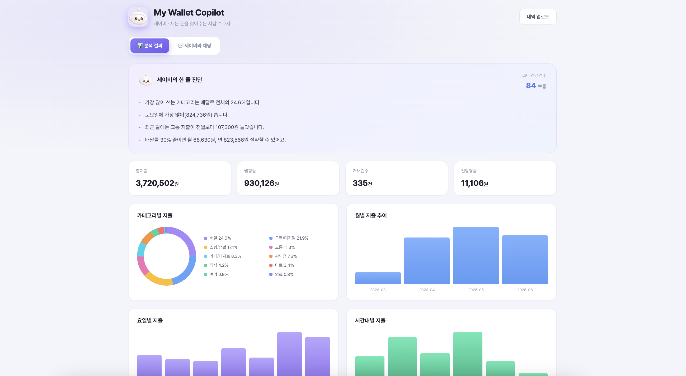
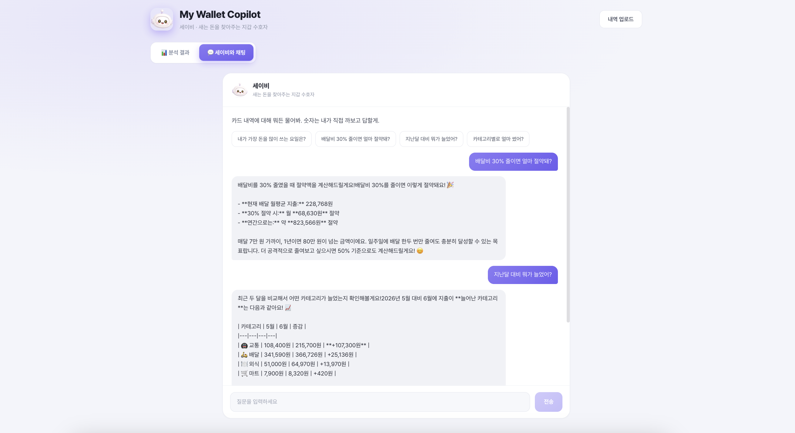

# 💰 My Wallet Copilot

카드 소비 내역을 올리면 **세이비(Savy)** 가 새는 돈을 찾아주는 AI 소비 분석 서비스입니다.

*세이비 — 새는 돈을 찾아주는 지갑 수호자*

## 무엇을 해주나요

**소비 한눈에** — 카테고리·월별·요일·시간대별 지출을 대시보드로 시각화  
**한 줄 진단** — 소비 건강 점수와 핵심 인사이트 자동 요약  
**절약 포인트** — "배달을 30% 줄이면 연 82만 원 절약" 같은 구체적 제안  
**자연어 질문** — "가장 돈을 많이 쓰는 요일은?", "지난달 대비 뭐가 늘었어?" 등에 실시간으로 답변

모든 숫자는 실제 카드 내역에서 직접 계산되며, AI가 임의로 지어내지 않습니다.

## 기술 스택

LangGraph · Next.js · FastAPI · Claude

